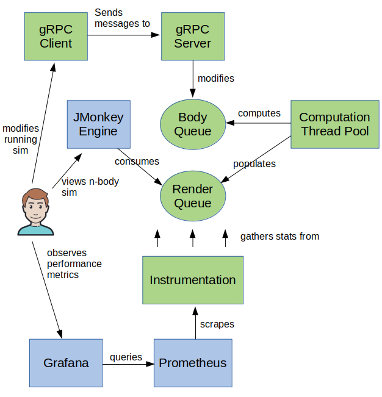
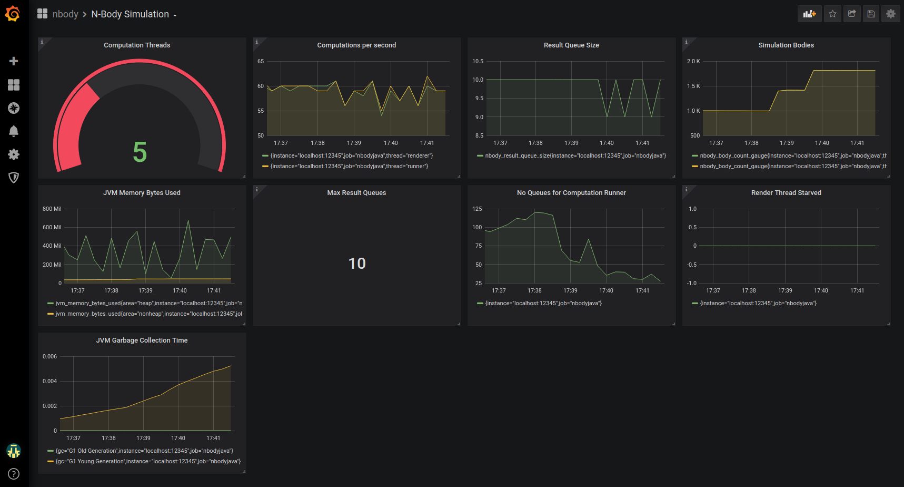

# Java N-Body Simulation

An n-body simulation that was inspired by this example: <http://physics.princeton.edu/~fpretori/Nbody/code.htm>. Calculates force - and changes in position - on multiple bodies in one or more threads, and renders them in a graphics engine in a separate thread. [JMonkeyEngine](https://jmonkeyengine.org/) (JME) is used as the graphics engine. The simulation implements elastic collisions in 3D thanks to: https://www.plasmaphysics.org.uk/programs/coll3d_cpp.htm. It supports different behaviors for bodies in the simulation when they collide:
1. Subsume - larger radius bodies absorb smaller radius bodies
2. Elastic Collision - bodies bounce off each other (thank you plasmaphysics.org.uk!)
3. Fragment - bodies fragment into smaller bodies based on force of impact
4. None - bodies pass through each other

This has been tested on a 12 core Ubuntu 18.04.3 LTS desktop with an integrated Intel graphics card. With this configuration, about 2000 bodies can be run with the JME frame rate running in the 50's. More bodies (approaching the 3000's) will start to slow the simulation. The number of bodies the sim can compute directly relates to the number of cores, and CPU speed. JMonkey is more influenced, obviously, by the number of bodies it has to render.

### Design:



Key points:
1. In the diagram, the green items were developed as part of this project, and the blue items are components integrated into this project.
2. A body queue holds all bodies in the simulation. A thread pool continually computes force, position, and collisions on the body queue.
3. Once each compute cycle is complete, the body info is copied into a render queue. The JMonkey Engine renders the render queue in its own thread while the compute thread pool runs another compute cycle on the body queue in parallel.
4. The user can interact with the simulation using a gRPC Java client that talks to a gRPC server. This is a command line interface that allows the user to add/remove bodies, change simulation characteristics, and so on while the simulation is running. A simple shell script is provided to wrap the gRPC client.
5. Instrumentation is provided that integrates with Prometheus and Grafana to provide instrumentation on simulation characteristics like thread interaction, etc. So using the gRPC client, you can increase/decrease threads and see the impact on performance, and so on. See https://prometheus.io/ and https://grafana.com/ for more information on those components.
6. The `additional/scripts` directory provides a Bash script (`start-containers`) to start Prometheus and Grafana in Docker containers with configurations that automatically integrate with the simulation. Details are discussed further on down.

This is a multi-module Maven project that produces two fat jars with dependencies:

1. server/target/server.jar is the simulation runner. You start it like: `java -jar server/target/server.jar`
2. client/target/client.jar is the gRPC client.  You run it like: `java -jar client/target/client.jar` with args to communicate with the simulation. Or, you can use the `additional/scripts/nbcli` Bash script after you tweak it for your environment.

### To run the application
The latest version of Java that I have tested with is 11.0.6:
```
$ java --version
openjdk 11.0.6 2020-01-14
OpenJDK Runtime Environment (build 11.0.6+10-post-Ubuntu-1ubuntu118.04.1)
OpenJDK 64-Bit Server VM (build 11.0.6+10-post-Ubuntu-1ubuntu118.04.1, mixed mode, sharing)
```
So to build and run:
```
$ mvn package
$ java -jar server/target/server.jar&
```

The above command (no args) runs the default canned simulation, which starts with four spherical clusters of bodies orbiting a sun. There are five canned sims, controlled via the `--sim-name` arg: `--sim-name=sim1` (the default) through `--sim-name=sim5`. The default number of bodies is 1000. You can also do: `--sim-name=empty` for an empty sim and then use the gRPC client to add bodies (more on that below.) Finally you can do `--csv=/path/to/a/file.csv` to load the sim from a CSV (more on that below).

With JME (I think due to the underlying libraries) there appear to be two options with regard to screen resolution: Option 1 supports full screen but you can't detach/attach the mouse and keyboard. Option 2 supports a windowed display - which is what I use - but then you can't resize the window once it is created (or, I have not figured out how to do so.)

When you run the sim it takes control of the mouse and keyboard. F12 disengages the sim from the mouse and keyboard. So you can use other windows. To give the sim the mouse and the keyboard back, click on the sim window and press F12 and the mouse pointer will disappear - indicating the JMonkey again owns the mouse and keyboard. The sim is defaulted to run with five threads computing the body queue. You can override that and many other settings using command line options and params. These are all documented further on in the README.

While JME has the mouse and keyboard, the following controls are active:

| Control | Meaning |
| :------ | :------ |
| W       | Cam Forward |
| A       | " Left |
| S       | " Back |
| D       | " Right |
| Q       | " Up |
| Z       | " Down |
| Mouse   | Look |
| keypad+ | Increase cam speed |
| keypad- | Decrease cam speed |
| F12     | Unbind/bind keyboard from/to the sim window |
| ESC     | Exit simulation |

### Simulator command line options
The following options are supported by the server jar. Most take short- and long-form:

| Option             | Meaning |
| :-------------- | :------- |
| -z,--resolution |  The default screen resolution is 2560x1405 because that's what happens to work for my configuration. You override it with this option: --resolution=2000x1000 or whatever value works for your configuration.
| --vsync |  Tells JMonkeyEngine to render in sync with the monitor vertical sync. Results in smoother rendering but overrides frame rate. True by default so override with --vsync=false |
| --frame-rate |  Specifies the frame rate. Ignored unless vsync is set to false. If vsync is false and frame rate is not specified then the frame rate is whatever JME selects |
| -r,--no-render |  A testing/debugging option. Turns off rendering. Useful for debugging the computation runner and performance testing the body computation code independent of rendering |
| -n,--sim-name |  Runs one of the built-in sims. "sim1" starts four clusters of bodies around a sun which are captured into orbit. "sim2" generates a sun at 0,0,0 and a cluster of bodies off-screen headed for a very close pass around with the sun at high velocity. Typically, a few bodies are captured by the sun but most travel away. "sim3" generates a simulation with a sun far removed from the focus area just to serve as light source. Creates two clusters composed of many colliding spheres in close proximity. The two clusters exert gravitational attraction toward each other as if they were solids. They also exert gravitational force within themselves, preserving their spherical shape. The two clusters orbit and then collide, merging into a single cluster of colliding spheres. "sim5" generates a sun far removed from the focus area just to serve as light source. Creates a large planet at the center of the sim orbited by three moons. Creates a small impactor headed for the large planet. The impactor is configured to fragment into many smaller bodies on impact. |
| -a,--sim-args | Some built-in sims can take additional args but - you'll have to check the code out for that |
| -c,--collision | Specifies the default collision resolution. Collision resolution can be specified as bodies are loaded from a CSV to start a new sim (see below) or individually as bodies are injected into the sim via gRPC. When bodies are added from CSV or gRPC if no collision resolution is specified then this value is used. ELASTIC is the default, meaning bodies bounce off each other |
| -b,--bodies | The number of bodies. The default is 1000. Your processing capacity will determine the number of bodies that can run in the sim with a smooth frame rate |
| -t,--threads | The number of threads for the body queue computation. Since each body's force is the product of each other body in the queue, the more threads, the more bodies you can support. JMonkey runs in its own thread and so this setting does not affect JMonkey. Body computation is purely CPU-bound so this value shouldn't exceed the number of available cores on your system |
| -m,--scaling | A time scale applied to force and velocity computation. The default value is .000000001F. It is a multiplier so the smaller the number the slower the simulation runs |
| -f,--csv |  Runs a simulation by loading bodies from a csv. The format is documented later on in this README |
| -l,--body-color | Only pertains to canned sims and CSV-loaded sims. Overrides body colors defined in the simulation. Some canned sims ignore this |
| -i,--initial-cam | Sets the initial camera position. The default is x=-100, y=300, z=1200 |

### The gRPC client
Once you start the simulation, you can interact with it using the gRPC client. The client communicates with a server component in the simulation to alter the sim. You invoke the client in one of two ways: either using the provided shell script: `additional/scripts/nbcli command options`, or by directly running the client jar: `java -jar client/target/client.jar command options`. Whether you use shell or the jar, the commands and options are identical:

| Command | Options and effect | Example (using the shell script) |
| :------ | :----------------- | :------ |
| set-threads | Sets the number of threads allocated to the body queue computation runner that calcs force from gravity, updates velocity, and resolves collisions. The default is 5 | `nbcli set-threads 8` |
| set-queue-size | Primarily for testing. The simulation has the ability to compute "n" cycles ahead of the JME engine and enqueue the computed results but the size of the compute-ahead queue is limited by this value. The default is 10 | `nbcli set-queue-size 100` |
| set-time-scale | Sets the time scale that is used to calc force and velocity change. The default value is .000000001F. It's a multiplier so the smaller the number the slower the sim runs  | `nbcli set-time-scale .0000000005F` <br> Since this is a smaller number than the default it will have the effect of slowing the simulation |
| set-restitution |  Sets the coefficient of restitution for elastic collisions. The default is one, meaning each collision is perfectly elastic. The setting applies to all bodies in the simulation. Values less than one cause collisions to become less energetic. Values larger than one cause more energetic collisions  | `nbcli set-restitution .6` <br>This will cause all body elastic collisions to have less energy and the bodies to move away from each other less after collision |
| remove-bodies | Removes approximately the specified number of bodies from the simulation. Pinned bodies are not removed. Specifying -1 removes all bodies, including pinned bodies. It's a way of resetting the sim back to empty before adding new bodies. | `nbcli remove-bodies 100` <br>Removes 100 bodies randomly from the sim, skipping bodies marked as pinned (more on that below.) |
| mod-body | Modifies properties of a body during the sim. E.g. changing the mass, radius, etc. | `nbcli mod-body id=123 ...` (more in this below) |
| mod-bodies | Modifies multiple bodies. More below | `nbcli mod-bodies class=asteroid ...` (more in this below)|
| get-config | Displays sim configuration values: restitution coefficient, number of bodies, threads in the computation runner thread pool, etc.          | `nbcli get-config` |
| add-body | Adds a body. More below  | `nbcli add-body ...` (more on this below) |
| add-bodies | Adds bodies. More below | `nbcli add-bodies ...` (more on this below) |

### Adding and modifying bodies in the running simulation using the gRPC client

The `add-body` command takes the following positional params. That means that you provide the params in order, specifying only the params values separated by spaces: `x y z vx vy vz mass radius`

Example: `nbcli add-body 10 10 10 10000000 10000000 10000000 10E21 30`

This command adds a body at x,y,z of 10,10,10 with vx,vy,vz of 10000000,10000000,10000000 having a mass of 10E21 and a radius of 30.

Additional params are supported in different forms:

Boolean params mean "true" if present and false if absent. Booleans are: `is-sun`, `telemetry`, and `pinned`. Example:

`nbcli add-body 10 10 10 10000000 10000000 10000000 10E21 30 is-sun telemetry pinned`

This adds a body just like the prior example, but sets it as a sun, turns on telemetry, and marks it as pinned.

The other args supported by the `add-body` command require parameter values: `collision`, `color`, `frag-factor`, `frag-step`, `class`, and `name`. These are documented in the table below, along with all the params  discussed above: 

| Option | Meaning | Example |
| :---- | :------ | :------ |
| x y z | Initial x, y, z position. Refer to this link for the JMonkeyEngine coordinate system: https://wiki.jmonkeyengine.org/jme3/the_scene_graph.html| see above |
| vx vy vz | Initial velocity in x, y, z| see above |
| mass | Mass. Generally, avoid masses greater than E30. Below, you will find references to existing sim examples that you can model| see above |
| radius | The radius. A radius of .5 is very small. A radius of 150 is rather large | see above |  
| is-sun | Means the body is a sun. You need at least one sun in every sim to serve as a light source othwise the entire sim will be black! | see above|
| telemetry | Emanates detailed info on a body to the console on each compute system. Produces large volumes of info. Primarily for debugging | see above |
| pinned | Means the body won't be deleted by the `remove-bodies` command unless a the command is provided with a value of -1. E.g. `nbcli remove-bodies -1` will remove even pinned bodies, but `nbcli remove-bodies 1000` will not | see above |
| collision | Defines the collision behavior. Values are (in any case): elastic, fragment, subsume, none. Elastic collisions result in bodies bouncing off each other. Fragment causes a body to fragment into pieces on collision. Subsume means that a body with a larger radius will absorb a body with a smaller radius - even a more massive body - on impact. And - none means no collision - bodies pass through each other. If not specified, the default is `elastic` | `collision=fragment` |
| color     | Defines the body color. Values are (in any case): random, black, white, darkgray, gray, lightgray, red, green, blue, yellow, magenta, cyan, orange, brown, pink. Color is ignored if `is-sun` is specified | `color=red`|
| frag-factor| Only meaningful if collision=fragment. Defines a "hardness". If two bodies of equal mass approaching at exactly opposite velocities collide in an elastic collision, they depart in exactly opposite velocity. This would be a frag factor of 1. So to make a body more likely to fragment, set the factor to a smaller number like .5, .1, etc. Note that a large fast moving massive body colliding with a small, slow, less massive body can dramatically alter the smaller body's velocity so - this is just a general way to simulate a body being shattered by an imact | `frag-factor=.1`|
| frag-step | Only meaningful if collision=fragment.  When a body is configured for fragmentation, this parameter participates in the calculation of the number of fragments to generate. Values from 10 to 1000 cause a fewer or greater number of fragments to be generated. Be aware that a large number of fragments can swamp the simulation | `frag-step=500` |
| class     | Used to group bodies together for subsequent modification | `class=asteroid`|
| name      | Names a body for subsequent modification | `name=earth`|

Examples:

This adds a sun that will absorb every smaller body that impacts it
`nbcli add-body 0 0 0 0 0 0 1E20 30 is-sun telemetry pinned collision=subsume`

This adds a body that will bounce off other bodies configured for elastic collision:
`nbcli add-body 100 100 100 10000000 10000000 10000000 1E3 3 collision=elastic color=blue`

This adds a body configured to fragment on collision:
`nbcli add-body  600 0 -600 -550000000 0 550000000 9E12 30 color=yellow collision=fragment frag-factor=.5 frag-step=400`

Each time you add a body, the ID of the created body is reported back to the console.

### The add-bodies command
The `add-bodies` command adds multiple bodies at one time. It takes all the same params as `add-body` plus the following:

| Option | Meaning | Example |
| :---- | :------ | :------ |
| qty      | The number of bodies to add | `qty=100` |
| delay    | A delay (in seconds) between the addition of each body | `delay=.5` |
| posrand  | Randomizes starting x,y,z from zero to the specified value | `posrand=10` |
| vrand    | Randomizes velocity  | `vrand=10000` |
| massrand | Randomizes mass | `massrand=1E4` |
| rrand    | Randomizes radius | `rrand=20` |

The following command adds 100 bodies that will bounce off other bodies configured for elastic collision with a tenth of a second delay between the addition of each body:
`nbcli add-bodies 100 100 100 10000000 10000000 10000000 1E3 3 collision=elastic color=blue qty=100 delay=.1`

For each added body, the ID of the created body is reported back to the console. The `additional/sims` directory contains a few examples of creating n-body simulations using the command line to add bodies to an empty sim

### The mod-body command
Sometimes it is interesting to change the properties of a body and observe the effect on the simulation. The `mod-body` command does this: `nbcli mod-body id=42 mass=12E29`. Or: `nbcli mod-body name=jupiter radius=150` 

The following can be provided to `mod-body` to select the body to modify:

| Option | Meaning | Example |
| :---- | :------ | :------ |
| id | The ID of the object | `nbcli mod-body id=123` |
| name | The name of the object - you had to have specified that when you created it | `nbcli mod-body name=foo` |

Then you can specify all the same params to modify that you originally specified when you created the body, in `param=value` form. E.g.: `nbcli mod-body name=foo radius=100 vz=-112312312 color=blue collision=elastic`. The only thing you cannot do is change a sun to a non-sun or vice versa. There is one additional param: `exists=false` which removes the body from the simulation

### The mod-bodies command
The `mod-bodies` command is the same as the `mod-body` command except that if you specify `class=someclass` then all the bodies of that class will receive the modification. Example: `nbcli mod-body class=asteroid exists=false` removes from the simulation all the bodies that were assigned the `asteroid` class when they were initially created.

### Loading a CSV
You can run a simulation populated from a CSV this way:
```
$ java -jar server/target/server.jar --csv=/full/path/to/file.csv
```
The format of the CSV is:

`x,y,z,vx,vy,vz,mass,radius,is_sun,collision_behavior,color,fragmentation_factor,fragmentation_step`
The following fields are required: `x, y, z, vx, vy, vz, mass, radius`. The remaining fields (`is_sun, collision_behavior, color, fragmentation_factor,fragmentation_step`) are optional and can be completely omitted, or specified with empty comma-delimited values - but the order must be exactly as shown above. In other words - the header isn't parsed it's just documentation for you. The CSV loader is really simply and expects things in ordinal position. If the first row is a header it is ignored. If any row cannot be parsed, it is echoed to the console and ignored. Example:
```
   x,   y,  z,         vx,       vy,       vz,    mass, radius, is_sun
   0,   3,  -3,         9,        2,        0,5.96E+30,     20, t
-146,-215,-328,-497827312,392344240,403464000,2.93E+12,0.421431
-269,-160,-442,-497827312,392344240,403464000,2.93E+12,0.421431
```  
The CSV can be compact (meaning without spaces). The example above is column-aligned for clarity of documentation. The "is-sun" column can be anything that evaluates to a boolean. If omitted or blank, the body is not a sun. There are a few CSVs in the "additiona" directory (see bekiw)

### The "additional" directory contents
The `additional` directory contains the following sub-directories that have various examples and other features:

| Sub-directory | Contents |
| :---- | :------ |
| csvs | Contains a handful of CSVs as examples E.g.: `java -jar server/target/server.jar --csv=additional/csvs/single-clump.csv`|
| grafana | Contains Grafana assets that are mounted into a Grafana Docker container by the `start-containers` script in the scripts directory. Prometheus/Grafana integration is discussed in more detail below |
| grpc-cli-examples | Contains a few examples of how to create simulations using something called `grpc_cli` which is a general purpose gRPC CLI tool that also works with the simulation in addition to the Java client. See https://github.com/grpc/grpc/blob/master/doc/command_line_tool.md |
| images | Misc. images linked by this README |
| original_cpp | This is the original C++ elastic collision code from plasmaphysics.org.uk that the elastic collision in this n-body sim incorporates. Just in case the link were ever to go away |
| prometheus | Has a Prometheus scrape config that is mounted into a Prometheus Docker container by the `start-containers` script in the scripts directory.|
| scripts | Contains the script that spins up the Prometheus/Grafana Docker containers, as well as a Bash script (`nbcli`) to wrap the gRPC client JAR. The idea for the client JAR wrapper script is: you edit into the script the location of your client JAR, and put the script in your PATH. Then you can run gRPC client commands more succinctly: `nbcli ...`|
| sims | Contains a few examples of how to create simulations using the Java gRPC client that is provided as part of this project |

### Prometheus/Grafana integration
An an exercise to get more familiar with Grafana and Prometheus, I implemented support for instrumentation. The `instrumentation` package contains an `InstrumentationManager` that is intended to be used like the Log4j LogManager. You get an instance of the instrumentation manager singleton, and register a counter:
```
private static final Metric metricComputationCount = InstrumentationManager.getInstrumentation()
            .registerLabeledCounter("nbody_computation_count/thread", "runner", "Simulation cycles");
```
Then, in a place in your code where you want to gather metrics:
```
metricComputationCount.incValue();
```
The three Prometheus metric types are supported: *counter*, *summary*, and *gauge*. The default implementation for instrumentation is a NOP implementation. So you can leave the instrumentation calls in your code while incurring a very minor overhead. My belief is - even in something like the body queue computation runner that is running 60 cycles per second, the overhead of the NOP implementation is low. Then, when you want to enable instrumentation, you run the server with a JVM property defined indicating the instrumentation class you want to load. The `instrumentation` package contains a class `PrometheusInstrumentation`. So to enable instrumentation using the included Prometheus instrumentation, you run the server this way: 
```
$ java -Dorg.ericace.instrumentation.class=org.ericace.instrumentation.PrometheusInstrumentation \
 -jar server/target/server.jar&
```
The Prometheus implementation integrates with the Prometheus Java libraries and runs an HTTP server that exposes metrics consumable by Prometheus on port 12345 (this is hard-coded). If you run with the Prometheus implementation, you can see the metrics using: `watch curl -s http://localhost:12345/metrics`. Of course, this isn't all that interesting. That's where Grafana comes in. After you run the server as described above, you run another script: `additional/scripts/start-containers`. First you will need to edit a path in the script that matches where you cloned the git repo. When you run this script it starts two containers and mounts the configs needed by both Prometheus and Grafana to present the metrics exposed by the n-body sim:
```
$ additional/scripts/start-containers
$ docker ps
CONTAINER ID  IMAGE            COMMAND                  STATUS         PORTS   NAMES
95b3e7122709  grafana/grafana  "/run.sh"                Up 7 minutes           grafana
7a9cab3d2931  prom/prometheus  "/bin/prometheus --c…"   Up 7 minutes           prometheus
```
After the the sim and the containers are running, view the dashboard at http://localhost:3000. Make sure your browser doesn't have tracking protection, or has disabled cookies etc. Log in as root/secret and you should see the n-body dashboard:



As you use the gRPC client to interact with the sim you can observe the impact on the simulation runtime. When you're done, just stop the Docker containers: ` docker stop grafana prometheus`.

## Developer Docs

### Modules:
As mentioned earlier this is a multi-module Maven project. The modules are:

| Module | Purpose |
| :---- | :------ |
| client | Provides a gRPC client in Java. This is packaged into the client.jar with dependencies |
| grpc | This module contains the protobuf definition of the gRPC interface in `grpc/src/main/resources/nbodyservice.proto`. The module also includes the protobuf-maven-plugin from https://www.xolstice.org/protobuf-maven-plugin . The plugin runs the protobuf compiler - **which you have to install yourself** - resulting in the generation of Java code to support the gRPC interface. On Ubuntu, installing the protobuf compiler was as simple as `sudo apt install protobuf-compiler` followed by `which protoc`. The protoc compiler is then referenced in the maven plugin using the `<protocExecutable>/usr/bin/protoc</protocExecutable>` element. All of the Java in this project is generated by the protobuf compiler on each build. So the workflow is - decide how you you want the gRPC interface to change - then change the nbodyservice.proto file to implement those changes - rebuild to regenerate the Java classes - then make the related changes in both the client and server modules using the generated Java in the grpc module to implement the functionality |
| server | The server runs the simulation, supports loading CSVs, parsing command line args, runs canned sims, includes a gRPC Server implementation for adding bodies and modifying sim characteristics, Integrates with JMonkey, runs the body computation thread pood, and exposes the Prometheus metrics. It is packaged in the fat server.jar module with dependencies - including the grpc module |
| shared | Just some shared globals packaged in with the client and the server jars |

## Key classes
Most of the interesting code is in the server module. The module contains four packages:

| Package | Purpose |
| :---- | :------ |
| grpcserver |  This package implements the gRPC server. It manages the RPC connection and delegates all the actual sim changes to the `sim` package|
| instrumentation | Implements NOP - and Prometheus - instrumentation. Integrates and wraps the Prometheus libs. Exposes the metrics on HTTP port 12345  |
| nbody | Encapsulates calculating each body's force, velocity, position, and collision once each sim cycle in a nested loop: for each body - for each other body - calc force and collision |
| sim | Contains the `Main` class for arg parsing, a class for loading CSVs and generating canned sims, and the `NBodySim` class which is the main sim runner - instantiating and starting all other classes and cleaning up on exit |

### Some interesting classes in the nbody package:
| Class | Purpose |
| :---- | :------ |
| Body |  Holds all the logic for force and velocity computation, collision resolution, and fragmentation |
| BodyMod | Encapsulates modifications to bodies in the sim on behalf of the gRPC server |
| ComputationRunner |  Runs the body queue computation using a thread pool. Each body is scheduled into the pool and has access to each other body - when  a body needs to modify a body other than itself it uses a dual `tryLock` mechanism. Places computed results into the `ResultQueueHolder` for JME  |
| JMEApp | Subclasses the JMonkeyEngine `SimpleApplication` - renders the simulation from the computation results in the `ResultQueueHolder` |
| ResultQueueHolder | Used by the compution runner to feed the JMonkeyEngine so JMonkey can render - and the body computation can run - in parallel without thread contention |
| SimpleVector |  A basic 3d vector class that also includes some interesting methods that were scavenged online for generating clusters of bodies used by the sim generators. Attribution in the source code |

### Some interesting classes in the grpcserver package:
| Class | Purpose |
| :---- | :------ |
| NBodyServiceServer | Serves the gRPC endpoint - parses the requests, delegates to the `NBodySim` class in the `sim` package, and handles the communication channel as reqruired by gRPC |

### Some interesting classes in the instrumentation package:
| Class | Purpose |
| :---- | :------ |
| InstrumentationManager | Singleton. Inspects the JVM for a defined property and uses it to instantiate the instrumentation class defined by the property. If no property is defined, instantiates the `NoopInstrumentation` class which does nothing |
| NoopInstrumentation |  When called to tally metrics, does nothing |
| PrometheusInstrumentation| Integrates with the Prometheus Java libs, gathers metrics and exposes them on port 12345 for Prometheus to scrape |

### Some interesting classes in the sim package:
| Class | Purpose |
| :---- | :------ |
| Main | Parses command line args, and delegates to the `SimGenerator` class to create simulations. Then transfers control to the `NBodySim` class to actually run the sim |
| NBodySim | Sim runner. Starts all threads, handles requests from the gRPC server to modify the simulation or report configuration, shuts everything down when the sim is over (when user presses ESC while JME has the keyboard) |
| SimGenerator | Generates one of five canned sims, or loads a sim from a CSV |

### Remaining TODOs 

* Windows testing - currently have tested exclusively on Ubuntu. Will require porting the Bash scripts to DOS/PowerShell
* Install Geforce RTX and see what that offers in terms of performance on the rendering side

If you have questions, you can reach me at: ericace-at-protonmail-dot-com
